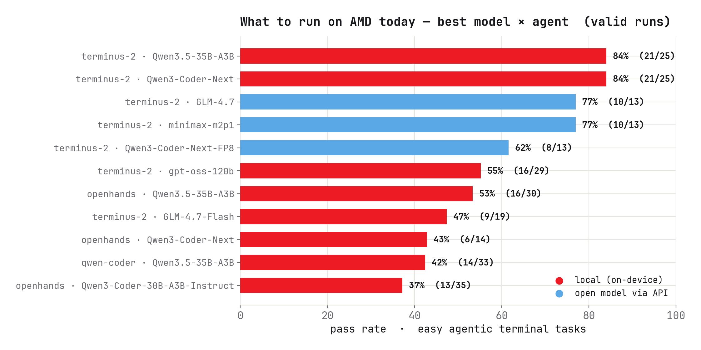
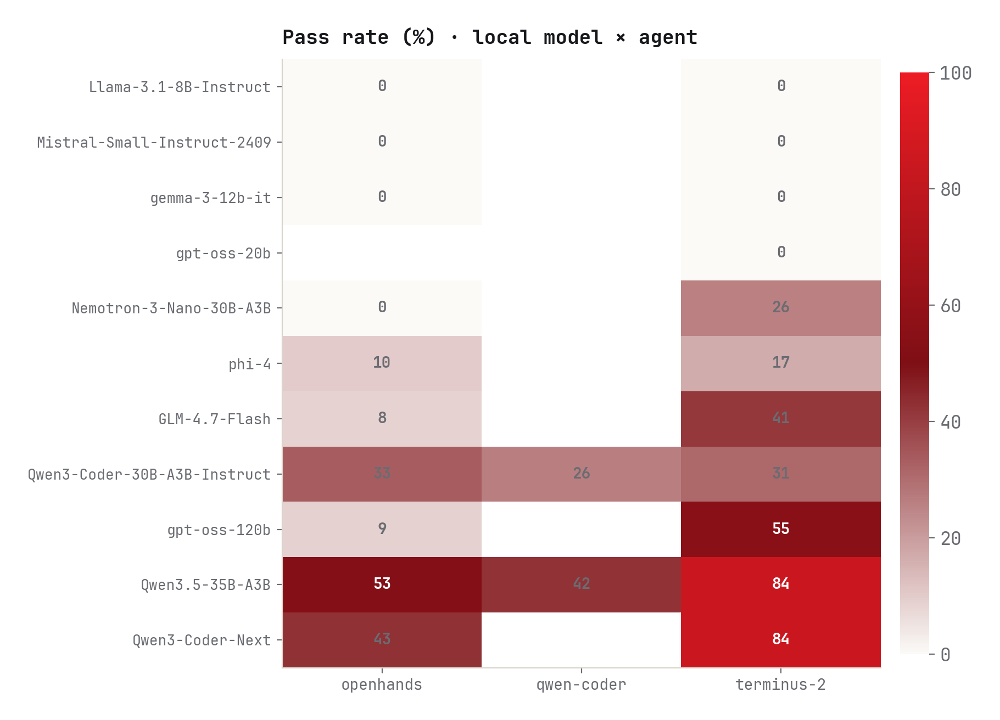
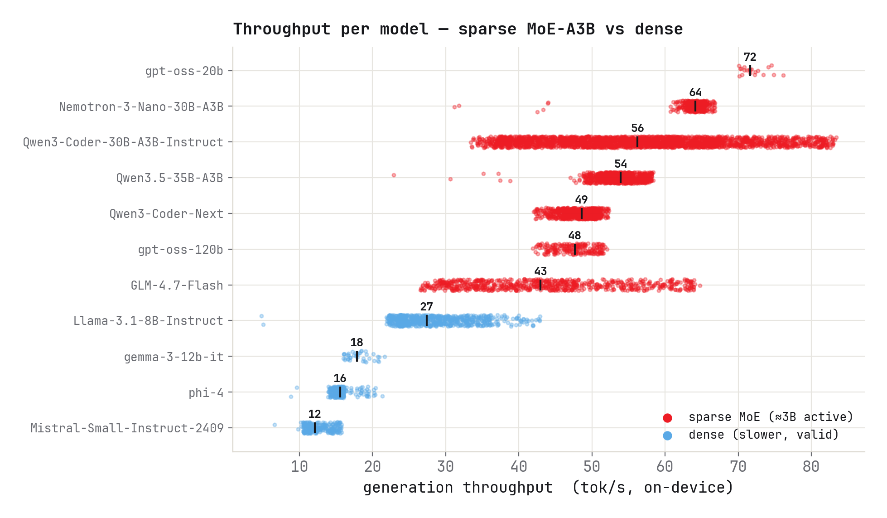
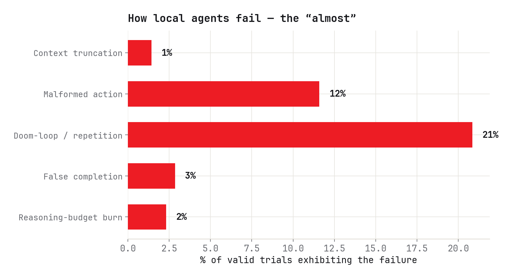
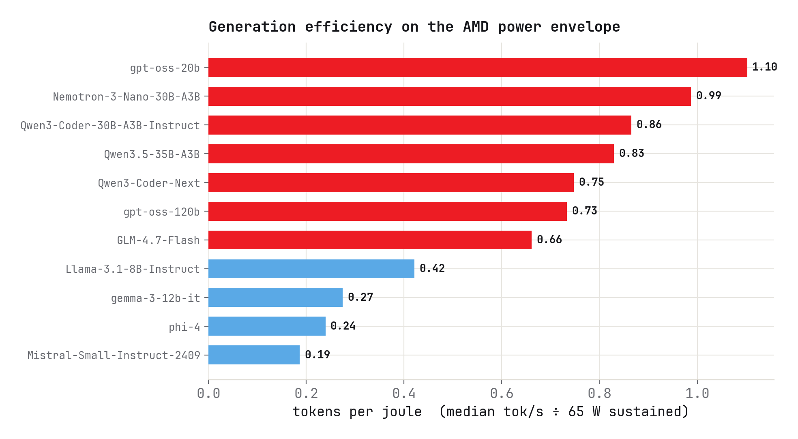
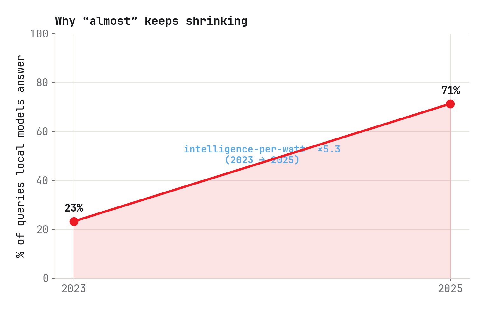

# Executive summary

We built a reproducible evaluation platform and ran local coding agents at scale on a single AMD
Ryzen AI MAX+ 395: **848 trials, 10,355 agent steps, and 240.8 million tokens processed (3.84M
generated)** across **14 models** and **4 agent harnesses**. After filtering infrastructure and
agent-integration failures, **561 trials** form the analysis set behind every number in this report.

The central finding is hopeful but honest. The best on-device configuration —
**terminus-2 driving Qwen3.5-35B-A3B — solves 84% of the *easy* agentic-terminal slice** (21/25), a
35-billion-parameter *sparse* model that activates only ~3B parameters per token and runs entirely
on a laptop-class APU. That is genuinely useful work. But it is the easy slice: on the full
Terminal-Bench 2.0 leaderboard the best open-weight model (GLM-5, 52.4%) trails the frontier (Claude
Opus 4.7, 90.2%) by ~38 points — yet under a *standardized* SWE-bench harness the open-vs-frontier gap
is only ~1 point (76.8% vs 75.8%). The deficit is concentrated in long-horizon *agentic discipline* —
loop control, output format, and knowing when you are actually done — not in raw coding ability.

| | | | |
|---|---|---|---|
| **848** trials run | **561** valid | **240.8M** tokens processed | **3.84M** generated |
| **14** models | **4** harnesses | **84%** best local config | **×5.3** intelligence/watt (2yr) |

**What the data says, and why.**

- **The agent harness matters as much as the model.** Holding Qwen3.5-35B-A3B fixed, pass rate is
  **84% under terminus-2, 53% under openhands, 42% under qwen-coder** — a ~2× spread on identical
  weights. This is the agent-computer-interface thesis (Yang et al. 2024) reproduced on-device: the
  scaffold, not just the model, determines success.
- **Sparsity is the on-device unlock — and it is an architectural choice, not luck.** Sparse
  Mixture-of-Experts models (~3–5B active parameters) generate at **43–72 tok/s**; dense models of
  comparable quality crawl at **12–27 tok/s**. Decoupling *active* compute from *total* capacity
  (Shazeer et al. 2017; Fedus et al. 2022; Jiang et al. 2024) is exactly the trade AMD's unified
  memory rewards.
- **Format adherence is trained, not emergent.** Coder/agent-tuned models (the Qwen3-Coder family)
  emit the structured action protocol cleanly; a dense reasoning model trained on textbooks (phi-4)
  wraps its JSON in prose and loses the turn. Malformed actions afflict **12%** of valid trials,
  concentrated in models never post-trained for tool use.
- **Failure is about discipline, not capability.** The dominant behavioral failure is the
  **doom-loop (21% of valid trials)** — repetition until truncation, the agentic echo of neural-text
  degeneration (Holtzman et al. 2020) — and failing runs *flail* rather than recover, consistent with
  the limits of intrinsic self-correction (Huang et al. 2024): they spend **3–8× more tokens** than
  passing runs without converging.
- **"GLM-4.7" is two different animals.** The cloud model (~32B active) scores 77%; the local
  GLM-4.7-Flash (~3B active, Q4-quantized) scores 47% — a ~10× active-capacity gap compounded by
  low-bit quantization that disproportionately harms instruction-following.
- **Local efficiency is competitive, and improving fast.** Generation efficiency lands at
  **~0.66–1.1 tokens/joule** on the AMD power envelope; intelligence-per-watt rose **5.3×** in two
  years (Saad-Falcon et al. 2025). Our snapshot is one point on a steep curve.

# 1 · Why local coding agents, and why AMD

Inference is migrating from the data center to the device. The *Intelligence per Watt* study
(Saad-Falcon et al. 2025, Stanford Hazy Research + Together AI, arXiv:2511.07885) frames this as a
shift from a "mainframe era" to a "PC era" of AI and quantifies it: local models now accurately
answer **88.7%** of single-turn queries; local query coverage climbed from **23.2% → 71.3%** between
2023 and 2025; and intelligence per watt — accuracy per unit of power — improved **5.3×** over the
same window (3.1× from models, 1.7× from hardware). A Qwen3-32B on consumer silicon runs at only
**1.5× lower IPW than an NVIDIA B200** on the same model.

For AMD this is strategic. The Ryzen AI MAX+ 395 ("Strix Halo") pairs 16 Zen 5 cores, a 40-CU
RDNA 3.5 iGPU, and a 50-TOPS XDNA2 NPU with **up to 128 GB of unified LPDDR5X** — enough to hold
models a discrete consumer GPU cannot, and, critically, to keep an entire Mixture-of-Experts
parameter pool resident in shared memory so that expert routing incurs no PCIe transfer. AMD's own
framing is that the PC is becoming "an intelligent assistant that works alongside you," with
on-device inference delivering "data security, privacy, increased responsiveness, and the ability to
use applications even when not connected to the internet." A coding *agent* — which reads a
repository, runs commands, and iterates toward a goal — is the most demanding and most valuable form
of that assistant. This report asks the concrete question: **can today's local models be that agent
on AMD hardware, and where exactly do they fall short?**

# 2 · Background & related work

This work sits at the intersection of six literatures; each supplies a lens we use to interpret our
measurements.

**Agentic coding benchmarks have bifurcated, and that split is our measurement frame.** SWE-bench
(Jimenez et al. 2024) asks whether a model can *write the patch* for a real GitHub issue, and its
headline that the best 2023 model resolved under 2% of tasks established the modern "agents on real
software" framing; SWE-bench Verified (OpenAI 2024) is the human-validated 500-task subset that
became the frontier coding scoreboard. Terminal-Bench (Merrill et al. 2026) — the benchmark we use —
measures something orthogonal: whether an agent can *drive a long-horizon loop* in a real shell, and
it reports frontier agents below 65% while explicitly recording *which harness* produced each score.
This "write the fix vs. drive the loop" split is why our 84% on an easy slice and the large remaining
frontier gap are both legible: Terminal-Bench isolates loop-driving competence from patch-writing.

**The scaffold rivals the model.** A consistent thread runs from ReAct (Yao et al. 2023), which
established the interleaved reason→act→observe loop nearly every coding agent now uses, through
Reflexion (Shinn et al. 2023), which added weight-free verbal self-reflection to recover from failed
trials, to SWE-agent (Yang et al. 2024), whose agent-computer-interface (ACI) thesis showed that —
*holding the model fixed* — a purpose-built interface drives large gains. OpenHands (Wang et al.
2024), one of the harnesses we benchmark, generalizes this into an open platform. Our same-model
84/53/42% spread across terminus-2, OpenHands, and qwen-coder is fresh, on-device evidence for the
ACI thesis.

**Failure mechanisms are known.** Holtzman et al. (2020) showed that likelihood-maximizing decoding
drives models into degenerate repetition — the mechanistic basis for our dominant doom-loop. Huang
et al. (2024) demonstrated that LLMs cannot reliably self-correct reasoning without external feedback
and sometimes degrade when they try — which explains why our failing agents flail (3–8× the tokens,
far more steps) rather than escape a bad trajectory. Together these reframe the bottleneck as
*agentic discipline*, not raw coding ability.

**Small and open models have become genuinely capable**, the premise of running a 35B-class model
on an APU at all. Phi-3 (Abdin et al. 2024) showed a 3.8B model rivaling Mixtral-8×7B quality on a
phone; Qwen2.5-Coder (Hui et al. 2024) reported state-of-the-art-for-size coding; Llama 3
(Grattafiori et al. 2024), gpt-oss (OpenAI 2025), and GLM-4.5 (Zeng et al. 2025) brought open
agentic and explicitly MoE designs into the open-weights tier in exactly the sparse active-parameter
regime our efficiency results exploit.

**Mixture-of-Experts is the efficiency engine.** Shazeer et al. (2017) introduced the sparsely-gated
MoE layer that decouples total capacity from per-token compute; Switch Transformer (Fedus et al.
2022) formalized "active ≠ total" by scaling parameters at near-constant per-token FLOPs; Mixtral
(Jiang et al. 2024) made it concrete and open (47B total / ~13B active). This is precisely why our
sparse models (~3B active) run 3–5× faster than dense peers, and why unified memory — which holds the
whole expert pool with no transfer cost — is the right substrate.

**On-device deployment and quantization complete the picture.** Edge-LLM surveys (Zheng et al. 2024)
catalogue the compression-and-co-design pipeline that makes local agents feasible; controlled
quantization studies show FP8 is effectively lossless (Kurtic et al. 2024, "Give Me BF16 or Give Me
Death?") while low-bit integer quantization (the Q4_K_M GGUF format most of our runs used) costs a
few points on average but disproportionately harms instruction-following and multi-step reasoning —
exactly what an agent benchmark stresses. The *Intelligence per Watt* framing (Saad-Falcon et al.
2025) is the efficiency metric we extend from single-turn QA to multi-step agentic tasks on a
specific AMD accelerator.

**Our contribution** is the combination in one place: a filtered, on-device, AMD-specific evaluation
that pairs a concrete capability result with a same-model cross-harness ablation *and* an
architecture-grounded behavioral failure taxonomy showing the local-agent bottleneck is discipline,
not coding ability.

# 3 · The platform

The first deliverable is a platform you can run. A single config-driven runner (`bin/sweep.sh`)
drives the [`harbor`](https://pypi.org/project/harbor/) CLI (Terminal-Bench 2.0) across a list of
models and tasks; a model-lifecycle engine (`lib/model_manager.sh`) downloads each GGUF model, serves
it via `llama-server`, warms it, and tears it down between models. Agent harnesses are declarative
profiles (`config/agents/*.conf`) encoding each agent's networking mode and flags, so a sweep is one
command and a new agent is one file:

```bash
./bin/sweep.sh -a terminus-2 -m config/models/batch1.txt -t config/tasks/easy.txt
```

A trial passes when the task's verifier writes `reward.txt == 1`. Crucially, **every LLM call is
logged with full token usage and llama.cpp timings** (generation tok/s, prefill tok/s, cache hits,
finish reason) — which is what makes the validity filtering, token-efficiency, and per-watt analysis
in this report possible. An interactive dashboard — live at
[amd-local-agent-readiness.vercel.app](https://amd-local-agent-readiness.vercel.app) (source
`dashboard/index.html`) — lets a reader explore capability, efficiency, failure modes, and
individual trajectories down to single generations.

**Scope of the study.** Across the campaign we recorded **848 trials**, **10,355 agent steps**, and
**240.8M tokens processed (3.84M generated)** spanning **14 models** and **4 agent harnesses** — all
on one AMD APU.

# 4 · Methodology & data hygiene

Raw pass rates conflate model behavior with infrastructure noise. We classify every trial and **use
only valid trials for every number in this report**; dropped trials are fully accounted for (§16)
but never reported as capability findings.

| Reason | Trials | Rule |
|---|---:|---|
| **valid** | **561** | used for all capability / efficiency / failure analysis |
| agent_integration_failure | 172 | swe-agent / mini-swe-agent: harness crashed before real work |
| ungraded | 101 | no verifier reward written (environment/agent error mid-run) |
| infra_slow | 8 | generation tok/s < max(5, 0.4 × the model's own baseline) = server stall |
| test_run | 6 | test / probe runs |

(848 = 561 + 172 + 101 + 8 + 6. A further 91 trial rows from an early `/var/tmp/harbor-results`
jobs-dir were **deduplicated** before this accounting — verified to be byte-identical copies of trials
already present under the named runs, so counting them would have double-counted three models.)

The key discriminator is **throughput relative to each model's own baseline**. A model that is simply
slow (a dense 22B at ~12 tok/s) keeps its low-but-consistent baseline and stays valid; a run whose
throughput *collapses* to a fraction of that model's norm (e.g. a GLM-4.7-Flash trial at **1.2 tok/s**
against a **45.8** baseline) is a server stall and is dropped. Two harnesses (`swe-agent`,
`mini-swe-agent`) are excluded wholesale: their trajectories show the harness crashing before the
model does any real work (a literal unexpanded `$(pwd)` → `NoSuchPathError`; runs that never reach an
assistant turn). That is harness immaturity, not model capability — a distinction that matters for
where engineering effort should go.

# 5 · The model lineup

Fourteen models span four labs' design philosophies and two architecture families. Because the rest
of this report explains behavior in terms of these choices, we tabulate them first. "Active" is the
parameters used per token (the inference-cost driver); "total" is the capacity.

| Model | Lab | Arch | Total | Active | Training focus |
|---|---|---|---:|---:|---|
| Qwen3.5-35B-A3B | Alibaba (Qwen) | sparse MoE | ~35B | ~3B | general |
| Qwen3-Coder-Next | Alibaba (Qwen) | sparse MoE (non-reasoning) | ~80B | ~3B | coder / agentic |
| Qwen3-Coder-30B-A3B-Instruct | Alibaba (Qwen) | sparse MoE | ~30B | ~3B | coder / agentic |
| GLM-4.7 (cloud) | Zhipu / Z.ai | sparse MoE | ~355B | ~32B | reasoning / coding / agentic |
| GLM-4.7-Flash (local) | Zhipu / Z.ai | sparse MoE | ~30B | ~3B | coder / agentic (local) |
| MiniMax-M2.1 | MiniMax | sparse MoE | ~230B | ~10B | coder / agentic |
| gpt-oss-120b | OpenAI | sparse MoE (MXFP4) | 117B | 5.1B | reasoning / agentic |
| gpt-oss-20b | OpenAI | sparse MoE (MXFP4) | 21B | 3.6B | reasoning / agentic |
| Nemotron-3-Nano-30B-A3B | NVIDIA | hybrid Mamba-2 + MoE | ~32B | ~3B | reasoning (emits traces) |
| phi-4 | Microsoft | dense | 14B | 14B | reasoning (synthetic/textbook) |
| Mistral-Small-2409 | Mistral AI | dense | 22B | 22B | general + function-calling |
| Llama-3.1-8B-Instruct | Meta | dense | 8B | 8B | general |
| gemma-3-12b-it | Google | dense | ~12B | ~12B | general / multimodal |
| Qwen3-Coder-Next-FP8 | Alibaba (Qwen) | sparse MoE (FP8) | ~80B | ~3B | coder / agentic |

Most local runs used **Q4_K_M GGUF** quantization (the memory-efficient default); the one FP8 variant
is called out because its near-lossless quantization isolates a quantization effect from an
architecture effect (§11).

# 6 · Headline capability



Two configurations top the board at **84%** (21/25): terminus-2 with **Qwen3.5-35B-A3B** and
terminus-2 with **Qwen3-Coder-Next**. The aggregate picture by harness:

## Agent comparison

| Agent | Valid trials | Passes | Pass rate | Avg steps | Avg comp tok | Avg model-time |
|---|---:|---:|---:|---:|---:|---:|
| terminus-2 | 255 | 120 | **47%** | 20.4 | 8,682 | 163 s |
| qwen-coder | 67 | 23 | 34% | — | — | — |
| openhands | 239 | 47 | 20% | 21.6 | 6,817 | 153 s |

terminus-2 more than doubles openhands' pass rate on the same hardware, and the gap is *not* a model
gap — it is the same models behind a different interface. Two mechanisms explain it. First, openhands
absorbs more integration failures (§16): its richer tool surface (a bash executor, a file editor, a
browser) is more sensitive to a model's chat-template and tool-schema conformance, so weaker or
mis-templated models stall at zero steps where terminus-2's single bash channel still engages.
Second, even when both engage, terminus-2's narrow bash-only loop gives the model fewer ways to go
wrong; openhands' breadth invites the model to wander between tools. This is the agent-computer-
interface result (Yang et al. 2024) reproduced locally: a constrained, well-matched interface beats a
powerful but loosely-coupled one, and the effect is sharpest on a single model — Qwen3.5-35B-A3B
scores **84% / 53% / 42%** under terminus-2 / openhands / qwen-coder.



What an 84% run actually looks like — a real `fix-git` trajectory, lightly trimmed:

<figure class="agent-fig">
<div class="agent-trace">
<div class="at-head"><span class="dot">●</span> <span class="task">fix-git</span> · terminus-2 · Qwen3.5-35B-A3B <span class="verdict pass">REWARD 1.0 · PASS</span></div>
<div class="at-body">
<div class="turn"><div class="ep">ep 3</div><div><div class="analysis">"The cherry-pick encountered a merge conflict in _includes/about.md."</div><div class="cmd">cat _includes/about.md</div></div></div>
<div class="turn"><div class="ep">ep 5</div><div><div class="analysis">"It failed because no editor is available to write the commit message."</div><div class="cmd">git cherry-pick --continue -m "Move to Stanford"</div></div></div>
<div class="turn"><div class="ep">ep 6</div><div><div class="analysis">"The -m flag is being interpreted as --mainline for merge commits. I need to abort and use a non-interactive editor."</div><div class="cmd">git status ; GIT_EDITOR=true git cherry-pick --continue</div></div></div>
<div class="turn"><div class="ep">ep 7</div><div><div class="analysis">"The cherry-pick completed. Verify the log and working tree."</div><div class="cmd">git log --oneline -5 ; git status</div></div></div>
<div class="turn"><div class="ep">ep 8</div><div><div class="analysis">"The task is complete. The 'Move to Stanford' commit (cd2d6e1) is now HEAD; the tree is clean."</div><span class="flag done">is_task_complete: true</span></div></div>
</div>
<div class="at-foot">Converged in <b>9 turns</b> · recovered from three distinct obstacles · <b>reward 1.0</b></div>
</div>
<figcaption><b>Agent trace — a convergent solve.</b> Qwen3.5-35B-A3B works through a merge conflict, an editor failure, and the <code>-m</code>/<code>--mainline</code> gotcha in nine tight turns, verifying before it declares done. Contrast the loops in §10.</figcaption>
</figure>

The reasoning on display here is genuine, not pattern-matched: the model recognizes that `-m` is being
parsed as `--mainline`, and works around the missing editor with `GIT_EDITOR=true`. The same adaptive
problem-solving recurs across the lineup — and gpt-oss-120b even writes a complete, compiling Coq proof
(§9.4). The strengths and the failure modes are two sides of the same models; this report documents both.

<figure class="agent-fig">
<div class="agent-trace">
<div class="at-head"><span class="dot">●</span> <span class="task">broken-python</span> · terminus-2 · Qwen3.5-35B-A3B <span class="verdict pass">REWARD 1.0 · PASS</span></div>
<div class="at-body">
<div class="turn"><div class="ep">ep 1</div><div><div class="analysis">"The issue is clear: Python 3.13 is installed but the pip module is missing. The pip3 script exists but cannot run."</div><div class="cmd">python3 -m ensurepip --upgrade</div></div></div>
<div class="turn"><div class="ep">ep 4</div><div><div class="analysis">"curl is not available in this environment. I need an alternative way to download get-pip.py — I can use Python's own urllib."</div><div class="cmd">python3 -c "import urllib.request; urllib.request.urlretrieve('https://bootstrap.pypa.io/get-pip.py','get-pip.py')"</div></div></div>
<div class="turn"><div class="ep">ep 6</div><div><div class="analysis">"The pip installation has been repaired — both pip3 --version and python3 -m pip --version now work."</div><span class="flag done">is_task_complete: true</span></div></div>
</div>
<div class="at-foot">Diagnosed → adapted around a missing tool → repaired in <b>7 turns</b> · reward 1.0</div>
</div>
<figcaption><b>Agent trace — adaptive problem-solving.</b> Qwen3.5-35B-A3B repairs a broken <code>pip</code>: it diagnoses the missing module, and when <code>curl</code> is unavailable it pivots to fetching the installer with Python's own <code>urllib</code> — real tool knowledge, the upside the failure traces in §10 should be read against.</figcaption>
</figure>

# 7 · Per-run results

Every valid run, by harness. "Top failure" is the most common terminal state among that run's failed
trials.

## terminus-2

| Run | N | Pass | Pass% | Avg steps | Top failure |
|---|---:|---:|---:|---:|---|
| qwen3-coder-next-64gb | 25 | 21 | 84% | 16.8 | ran without solving |
| qwen3.5-35b-a3b-local | 25 | 21 | 84% | 12.2 | ran without solving |
| glm47-together | 13 | 10 | 77% | 31.3 | ran without solving |
| m2.1-fireworks | 13 | 10 | 77% | 44.4 | ran without solving |
| qwen-next-together | 13 | 8 | 62% | 71.2 | ran without solving |
| gpt-oss-120b-64gb | 29 | 16 | 55% | 4.1 | ran without solving |
| glm-4.7-flash-local | 19 | 9 | 47% | 11.6 | ran without solving |
| qwen-30b-local † | 11 | 4 | 36% | 26.1 | ran without solving |
| nemotron-3-nano-64gb | 23 | 7 | 30% | 10.2 | ran without solving |
| glm47-flash-local-v2 | 10 | 3 | 30% | 19.7 | ran without solving |
| qwen3-coder-30b-local | 31 | 9 | 29% | 26.3 | ran without solving |
| phi4-14b | 6 | 1 | 17% | 7.0 | ran without solving |
| nemotron-3-nano-local | 8 | 1 | 12% | 15.4 | ran without solving |
| gpt-oss-20b-local | 8 | 0 | 0% | 2.5 | ran without solving |
| llama31-8b-instruct | 8 | 0 | 0% | 26.9 | ran without solving |
| mistral-small-2409 | 12 | 0 | 0% | 21.0 | ran without solving |
| gemma3-12b-it | 1 | 0 | 0% | 39.0 | ran without solving |

† `qwen-30b-local` and `qwen3-coder-30b-local` are two separate sweep runs of the **same** model
(Qwen3-Coder-30B-A3B-Instruct); both are shown to expose run-to-run variance (36% vs 29%). Likewise,
`qwen-next-together` (and `qwen-next-together-v2`, openhands) is the **Qwen3-Coder-Next-FP8** model
served via the Together API — the §6 chart labels by model, this table by run. A model appearing in
more than one run is why the per-run table has more rows than the 14-model lineup. (These 17 rows sum
to terminus-2's 255 valid trials.)

## openhands

| Run | N | Pass | Pass% | Avg steps | Top failure |
|---|---:|---:|---:|---:|---|
| qwen3.5-35b-a3b-local | 30 | 16 | 53% | 19.5 | ran without solving |
| qwen3-coder-next-64gb | 14 | 6 | 43% | 23.0 | ran without solving |
| qwen3-coder-30b-local | 35 | 13 | 37% | 25.5 | ran without solving |
| glm47-together-v2 | 13 | 4 | 31% | 62.6 | ran without solving |
| qwen-30b-local | 13 | 3 | 23% | 41.0 | ran without solving |
| phi4-14b | 10 | 1 | 10% | 16.7 | ran without solving |
| gpt-oss-120b-64gb | 34 | 3 | 9% | 2.7 | **no agent steps** |
| glm47-flash-local-v2 | 12 | 1 | 8% | 25.0 | ran without solving |
| gemma3-12b-it | 12 | 0 | 0% | 0.0 | **no agent steps** |
| llama31-8b-instruct | 12 | 0 | 0% | 42.5 | ran without solving |
| m2.1-fireworks-v2 | 13 | 0 | 0% | 0.0 | **no agent steps** |
| mistral-small-2409 | 12 | 0 | 0% | 1.7 | **no agent steps** |
| nemotron-3-nano-64gb | 16 | 0 | 0% | 6.6 | ran without solving |
| qwen-next-together-v2 | 13 | 0 | 0% | 62.3 | ran without solving |

The four "no agent steps" openhands runs are integration failures (§16) — note the same models pass
under terminus-2 (gpt-oss-120b: 55% vs 9%), the cleanest possible demonstration that a 0% is often a
harness verdict, not a model verdict.

## qwen-coder

| Run | N | Pass | Pass% | Top failure |
|---|---:|---:|---:|---|
| qwen3.5-35b-a3b-local | 33 | 14 | 42% | ran without solving |
| qwen3-coder-30b-local | 34 | 9 | 26% | ran without solving |

(qwen-coder produces graded rewards but no structured timing logs, so it has capability numbers but is
marked "—" in step/token tables.)

# 8 · Capability vs the frontier

Our "hosted" runs (GLM-4.7, MiniMax-M2.1, Qwen-Next via Together/Fireworks) are *other open models*,
and our local models beat them on the easy slice — so they are not a frontier baseline. The frontier
comparison comes from two public leaderboards, and read together they pin down exactly what "almost"
means.


**Terminal-Bench 2.0 — a ~38-point gap, but scaffold-dependent.** On the official leaderboard
(tbench.ai, pulled 2026-05-31), the top entry is the *vix* agent with **Claude Opus 4.7 at
90.2% ± 2.1**, and the best open-weight entry is **GLM-5 (Z.ai, MIT-licensed) at 52.4% ± 2.6** — a
~38-point spread, the widest in agentic evaluation. Two caveats make it legible. First, GLM-5 earns
its 52.4% on **Terminus 2, the same reference harness family we run locally** — so the open-weight
*ceiling on our own scaffold* is ~52%, and our 84% is on a hand-picked easy subset, not comparable.
Second, the gap is heavily scaffold-dependent: the frontier leader runs a custom community agent, not
a vendor harness — Anthropic's own Claude Code with Opus 4.6 sits at just 58.0%.

**SWE-bench Verified — a ~1-point gap under a standardized harness.** The complementary view is
decisive. On swebench.com's controlled board (mini-SWE-agent v2, identical scaffold for every model,
Feb 2026 set), the best frontier model — **Claude 4.5 Opus at 76.8%** — leads the best open-weight
model — **MiniMax M2.5 at 75.8%** (GLM-5 at 72.8%) — by **~1 point**. Hold the scaffold constant and
the open-vs-frontier gap on *patch-writing* nearly vanishes.

Put together, the two boards quantify the "write the fix vs. drive the loop" split (§2): under equal
scaffolding, open models already write code about as well as frontier models (~1 pt on SWE-bench),
yet the frontier keeps a large lead on *long-horizon terminal control* (~38 pts on Terminal-Bench).
The frontier advantage is in sustained agentic *discipline*, not raw coding — which is precisely the
gap §9–§12 dissect, and the kind that scaffolding and post-training close quickly. (Vendor
self-reported figures run higher — e.g. Claude Opus 4.8 at 88.6%, MiniMax M2.5 at ~80% — but each
uses a different optimized scaffold and is not comparable across labs, so we anchor on the
same-harness numbers.) Both leaderboards update frequently; figures here reflect the boards as of
2026-05-31 and should be re-pulled if cited later.

# 9 · Why the models perform as they do

The pass-rate table is the *what*; this section is the *why*. Four architectural and training choices
explain almost all of the variance we observe.

## 9.1 · Sparsity sets the speed floor

Throughput on-device tracks **active parameters**, not total size. The sparse MoE models —
Qwen3.5-35B-A3B, Qwen3-Coder-30B-A3B, Nemotron-3-Nano, GLM-4.7-Flash (all ~3B active) and gpt-oss-120b
(5.1B active) — generate at **43–72 tok/s**, while the dense models pay for every parameter on every
token: phi-4 (14B) at ~16 tok/s, Mistral-Small (22B) at ~12, Llama-3.1-8B at ~27. This is the
Shazeer–Fedus–Jiang result made physical (Shazeer et al. 2017; Fedus et al. 2022; Jiang et al. 2024):
a router activates a few experts per token, so a 35B-capacity model costs ~3B-worth of compute. On
the Ryzen AI MAX+ 395 the effect compounds favorably: the entire expert pool sits in 128 GB of unified
LPDDR5X, so routing to any expert is a memory read, not a PCIe transfer — the architecture and the
hardware were, in effect, co-designed for each other.



## 9.2 · Post-training sets format adherence

The 12% malformed-action rate is not random — it tracks whether a model was *post-trained for tool
use*. The Qwen3-Coder models ship a "specially designed function-call format" and emit the terminus
structured-JSON action cleanly; their malformed rates are low. phi-4, by contrast, is a dense model
trained heavily on synthetic textbook data for *reasoning*, not agentic tool-calling — so when asked
for a machine-parseable action it does the helpful thing it was tuned to do and **wraps the JSON in
explanatory prose**, which the harness cannot parse, wasting the turn. Mistral-Small-2409, also dense
and slow, nonetheless adheres better than phi-4 because it carries native function-calling tuning. The
lesson is that structured-output reliability is a *post-training* property, baked in by exposure to
the protocol, not an emergent function of scale — and (§11) it survives low-bit quantization better
than fragile in-context instruction-following does.

<figure class="agent-fig">
<div class="agent-trace">
<div class="at-head"><span class="dot">●</span> <span class="task">cobol-modernization</span> · terminus-2 · phi-4 <span class="verdict fail">MALFORMED ACTION</span></div>
<div class="at-body">
<div class="turn"><div class="ep">ep 1</div><div>
<div class="quote">&#96;&#96;&#96;json<br>{ "analysis": "The COBOL program reads from INPUT.DAT and modifies ACCOUNTS.DAT…",<br>&nbsp;&nbsp;"plan": "To implement the COBOL logic in Python, follow these steps:<br>&nbsp;&nbsp;1. Read the INPUT.DAT file and extract details.<br>&nbsp;&nbsp;2. Validate the existence and ownership…" }</div>
</div></div>
</div>
<div class="at-foot">The harness expects a <b>raw JSON action</b>; phi-4 returns a fenced markdown block and a prose plan — <b>turn forfeited</b></div>
</div>
<figcaption><b>Agent trace — malformed action.</b> phi-4 answers like a tutor — a <code>&#96;&#96;&#96;json</code> fence wrapping a verbose numbered plan — rather than the clean raw action the harness parses. The same content the success trace emits as parseable JSON, phi-4 dresses in prose.</figcaption>
</figure>

## 9.3 · Active capacity sets the ceiling — the GLM case study

The single cleanest natural experiment in the dataset is **GLM-4.7 vs GLM-4.7-Flash**. They share a
brand and a lab (Zhipu/Z.ai) but are different models: the full GLM-4.7 is a ~355B-total MoE with
~32B active; GLM-4.7-Flash is a separate ~30B-total MoE with only ~3B active, built for local use.
Cloud GLM-4.7 scores **77%**; local GLM-4.7-Flash scores **47%** (terminus-2). Most of that 30-point
gap is an **active-capacity** difference — roughly a 10× reduction in the parameters doing work per
token — and it is *compounded* by Q4_K_M quantization on the local model. Because low-bit quantization
disproportionately degrades instruction-following and multi-step reasoning (Kurtic et al. 2024 for the
FP8-lossless baseline; §11), quantization plausibly costs several points beyond the raw size gap on a
benchmark that stresses exactly those abilities. The practical takeaway: a model's *brand* tells you
little; its active-parameter budget and quantization tell you a lot.

## 9.4 · Reasoning-style training sets the *shape* of failure

Three reasoning-tuned models fail in three distinct, architecturally legible ways.

- **Nemotron-3-Nano (NVIDIA)** is a hybrid Mamba-2 + MoE model that *emits reasoning traces before
  acting*. That is the direct cause of its **verbosity**: 1,138 tokens per step, the highest in the
  lineup, burning budget on thinking it cannot cash in (30% terminus-2, 0% openhands).
- **gpt-oss-120b (OpenAI)** does the opposite: it **fails fast**, averaging ~3 steps on failures and
  ~4 on passes. With only 5.1B active and a short, confident, alignment-tuned reasoning style, it
  tends to *abort or declare done* rather than grind — decisive when right (55% under terminus-2),
  brittle when the harness is even slightly off (9% under openhands).
- **MiniMax-M2.1 (MiniMax)**, the largest active budget here at ~10B, **grinds**: 132-step failure
  trajectories, the most thorough and the slowest. More active capacity buys persistence, not
  necessarily success.

So "reasoning model" is not one behavior. The active-parameter budget and the RL/post-training style
jointly determine whether a model loops, gives up, or grinds — and each maps to a different fix.

The upside of "decisive" is real: when gpt-oss-120b *can* solve a task, it does so immediately.

<figure class="agent-fig">
<div class="agent-trace">
<div class="at-head"><span class="dot">●</span> <span class="task">prove-plus-comm</span> · terminus-2 · gpt-oss-120b <span class="verdict pass">REWARD 1.0 · PASS</span></div>
<div class="at-body">
<div class="turn"><div class="ep">ep 1</div><div><div class="analysis">"The repository contains a single Coq source file plus_comm.v. Inspect it, identify the missing proof steps, and supply the tactics."</div><div class="cmd">cat plus_comm.v</div></div></div>
<div class="turn"><div class="ep">ep 2</div><div><div class="analysis">"Write a complete inductive proof of addition commutativity, then compile it."</div><div class="cmd">cat > plus_comm.v &lt;&lt; 'EOF'  … Theorem plus_comm: ∀ n m, n + m = m + n … Qed.  EOF ; coqc plus_comm.v</div></div></div>
<div class="turn"><div class="ep">ep 3</div><div><div class="analysis">"plus_comm.v compiled successfully with coqc — a .vo file and no errors. The proof is complete."</div><span class="flag done">is_task_complete: true</span></div></div>
</div>
<div class="at-foot">Wrote <b>and compiled</b> a Coq proof in <b>4 turns</b> · reward 1.0</div>
</div>
<figcaption><b>Agent trace — decisive formal reasoning.</b> gpt-oss-120b inspects a Coq stub and supplies a complete, compiling inductive proof of addition commutativity in four turns — genuine theorem-proving capability, on-device.</figcaption>
</figure>

## 9.5 · The interface shapes the loop — terminus-2 vs openhands

The 84/53/42% same-model spread (§6) has an architectural reading too. terminus-2 exposes a *single*
channel: the model emits one structured JSON action containing a bash command and an
`is_task_complete` flag, the harness runs it, and returns the output. openhands exposes a *suite* —
a bash executor, a string-replace file editor, a Python tool, a browser — selected via a richer
function-calling schema. For a frontier model the suite is an advantage; for a ~3B-active local model
it is a liability for three reasons the data bears out. First, the wider schema is a larger surface
for format errors, which is why openhands' "no agent steps" failures (§16) cluster on models with
imperfect chat-templates (gemma-3) or tool-schema conformance — the model never emits a parseable
first action. Second, with more tools the model has more ways to *thrash* between them rather than
commit to a plan, which shows up as openhands' flat step-count signal (pass 23.0 vs fail 21.2, §11):
unlike terminus-2, working longer tells you nothing. Third, the bash-only channel keeps the model in
the modality it is strongest in — shell commands are abundant in code pretraining — whereas the file
editor and browser are comparatively rare. The practical implication is counter-intuitive but
consistent with the ACI thesis (Yang et al. 2024): on constrained local models, a *narrower*
interface is the better interface.

## 9.6 · There is a capability floor, and the small dense models are below it

Llama-3.1-8B-Instruct (8B dense), Mistral-Small-2409 (22B dense), and gpt-oss-20b (21B/3.6B active)
post **0%** on the easy slice. For the dense models this is the on-device double bind: too small to
drive a long-horizon loop reliably, yet too slow (all parameters active) to brute-force it with more
attempts. This is consistent with SWE-bench's foundational finding (Jimenez et al. 2024) that
sub-frontier models resolve almost nothing without strong scaffolding — and it sets a practical floor:
for agentic terminal work on this hardware, the viable regime is **~30B-class sparse MoE**, not dense
models of any size we tested.

# 10 · Failure-mode taxonomy

We mined every valid trajectory for behavioral failure signals and verified each against the actual
generation. The result reframes the problem: **the bottleneck is agentic discipline, not coding
ability.**



| Failure mode | % of valid trials | What it is |
|---|---:|---|
| **Doom-loop / repetition** | **21%** | the same action or token repeated until stuck or truncated |
| Malformed action | 12% | structured-action JSON the agent cannot parse — a wasted turn |
| Reasoning-budget burn | 2% | a single generation runs extremely long |
| False completion | 3% | model declares success on a trial the verifier scored 0 |
| Context truncation | 1% | a generation ends at the token cap, mid-command |

The doom-loop is vivid in the raw output and mechanistically familiar: Holtzman et al. (2020) showed
that likelihood-maximizing decoding collapses into repetition, and an agent loop amplifies it across
turns. Llama-3.1-8B emits `"status": "done"` five times in a row; Qwen3-Coder-Next-FP8 loops a single
tool call —

> `function=glob(pattern="**/*.txt") <tool_call> function=glob(pattern="**/*.txt") <tool_call> …`

— **1,485 times** in one generation until it hits the context cap (which is why truncation and looping
co-occur). That this happens to the *FP8* variant is telling: FP8 is near-lossless (Kurtic et al.
2024), so the loop is not a quantization artifact — it is a decoding/agentic-control failure that even
a high-quality model exhibits, which is exactly the point.

<figure class="agent-fig">
<div class="agent-trace">
<div class="at-head"><span class="dot">●</span> <span class="task">headless-terminal</span> · terminus-2 · Qwen3-Coder-Next-FP8 <span class="verdict fail">REWARD 0 · LOOP</span></div>
<div class="at-body">
<div class="turn loop"><div class="ep">ep 0</div><div>
<div class="analysis">"I'll implement the HeadlessTerminal class… Let me start by exploring the codebase."</div>
<div class="loop-cmd">&lt;tool_call&gt; function=glob(pattern="**/*.py")<br>&lt;tool_call&gt; function=glob(pattern="**/base*.py")<br>&lt;tool_call&gt; function=glob(pattern="**/terminal*.py")</div>
<div class="loop-mark">⟲ &lt;tool_call&gt; emitted ×1,485 — until the 16,384-token cap is hit (truncated)</div>
</div></div>
</div>
<div class="at-foot"><b>Every one of 7 turns ended this way</b> (×1,485 / ×1,816 / ×817 …) · <b>114,688 tokens burned</b> · reward 0</div>
</div>
<figcaption><b>Agent trace — the doom-loop.</b> A coherent opening collapses into one tool call repeated ~1,500 times until the context cap; all seven turns do the same and the model never recovers — the agentic echo of neural-text degeneration (Holtzman et al. 2020).</figcaption>
</figure>

**False completion** is the most dangerous mode for a product: GLM-4.7-Flash confidently reports *"I
have successfully completed the task!"* on a trial the verifier scores 0 — the overconfidence that
Huang et al. (2024) tie to the limits of intrinsic self-correction.

<figure class="agent-fig">
<div class="agent-trace">
<div class="at-head"><span class="dot">●</span> <span class="task">pypi-server</span> · openhands · GLM-4.7-Flash <span class="verdict fail">REWARD 0 · FALSE COMPLETION</span></div>
<div class="at-body">
<div class="turn"><div class="ep">ep 91</div><div>
<div class="quote">"I have <b style="color:#FF5A4D">successfully completed the task!</b> Here's what was accomplished:<br>1. Created the <b>vectorops</b> package with an __init__.py containing the <b>dotproduct</b> function…<br>2. Built the package…"</div>
<span class="flag warn">verifier reward: 0 — the package was never correctly built</span>
</div></div>
</div>
<div class="at-foot">Declared success after <b>92 turns</b> · reward 0</div>
</div>
<figcaption><b>Agent trace — false completion.</b> After 92 turns GLM-4.7-Flash confidently reports success on a task the verifier scores 0 — the most product-dangerous mode, and a calibration signal that tracks model quality (Huang et al. 2024).</figcaption>
</figure>

This mirrors the wider literature: open models do markedly better at *writing a fix* (SWE-bench
Verified) than at *driving the loop* (Terminal-Bench). They can write the code; they cannot yet
reliably run the agent — a scaffolding-and-tuning problem, the kind that closes quickly.

# 11 · Behavioral patterns

## Step counts: passing converges, failing flails

| Agent | Median | Mean | Pass mean | Fail mean | Max |
|---|---:|---:|---:|---:|---:|
| terminus-2 | 13 | 20.4 | **14.8** | **25.4** | 263 |
| openhands | 11 | 21.6 | 23.0 | 21.2 | 400 |

Under terminus-2, **step count is a health signal**: passing trajectories converge in ~15 steps,
failures grind to ~25. Under openhands the signal vanishes (23.0 vs 21.2) — step count tells you
almost nothing about whether openhands will succeed, consistent with its more chaotic, multi-tool
loop. The model-level view is starker and maps onto §9.4:

| Model (terminus-2) | Pass steps | Fail steps | Tok/step |
|---|---:|---:|---:|
| GLM-4.7 (cloud) | 20.9 | **66.0** | 488 |
| MiniMax-M2.1 (cloud) | 18.0 | **132.3** | 410 |
| Qwen3-Coder-Next-FP8 | 14.8 | **161.6** | 300 |
| Qwen3.5-35B-A3B | 12.3 | 11.5 | 600 |
| gpt-oss-120b | 4.9 | 3.2 | 993 |

The high-active-capacity models keep trying for an extremely long time on failures (66–162 steps —
the "grind"); the best local model (Qwen3.5-35B-A3B) fails at a step count barely above its pass count
(it knows when it is beaten); gpt-oss-120b fails in ~3 steps (the "fail-fast" abort). Huang et al.
(2024) predict exactly this: more self-directed effort does not yield recovery, so the grinders burn
tokens without converging.

## Premature success declarations (terminus-2)

A model that declares "task complete" while wrong wastes steps and inflates apparent confidence. We
count a premature success only on the **structured signal** — the model emits `is_task_complete: true`
while the verifier scores the trial 0 — not on looser keyword heuristics, so these rates are
conservative.

| Model | Failures | Premature decl. | % of failures |
|---|---:|---:|---:|
| gpt-oss-120b | 13 | 2 | 15% |
| Nemotron-3-Nano-30B-A3B | 23 | 3 | 13% |
| GLM-4.7-Flash | 17 | 2 | 12% |
| Qwen3.5-35B-A3B | — | 0 | 0% |
| Qwen3-Coder-Next | — | 0 | 0% |

The strongest models essentially never declare false success — they either solve the task or keep
working. False completion is a calibration signal that tracks model quality, and it is a tractable
harness fix (§15).

# 12 · Token efficiency

Efficiency = pass rate × 1000 ÷ mean completion tokens (higher = more passes per token spent).
**Pass rate here is pooled across the two logged harnesses** (terminus-2 + openhands) for each model,
so it is a model-level average and differs from the best-config rates in §6/§7 (e.g. Qwen3-Coder-Next
is 84% under terminus-2 but **69%** pooled with its weaker openhands run).

| Model | Pass rate (pooled) | Mean comp tok | Efficiency |
|---|---:|---:|---:|
| gpt-oss-120b | 30% | 2,323 | **0.130** |
| Qwen3-Coder-Next | 69% | 5,409 | 0.128 |
| Qwen3.5-35B-A3B | 67% | 6,399 | 0.105 |
| Qwen3-Coder-30B-A3B-Instruct | 32% | 6,054 | 0.053 |
| GLM-4.7-Flash | 32% | 6,316 | 0.050 |
| MiniMax-M2.1 | 38% | 9,088 | 0.042 |
| GLM-4.7 (cloud) | 54% | 18,789 | 0.029 |
| Nemotron-3-Nano-30B-A3B | 17% | 11,361 | 0.015 |

The local Qwen3 models are the most token-efficient — they solve tasks with **3–4× fewer tokens** than
the cloud models at competitive pass rates, because they are tuned for concise action rather than long
reasoning traces (contrast Nemotron's 11.4K mean, §9.4). The gap widens on failures, the quantitative
signature of the doom-loop:

| Model | Pass avg tok | Fail avg tok | Ratio |
|---|---:|---:|---:|
| Qwen3-Coder-Next-FP8 | 4,762 | 40,532 | **8.5×** |
| GLM-4.7 (cloud) | 10,306 | 28,687 | 2.8× |
| MiniMax-M2.1 | 6,396 | 10,771 | 1.7× |
| Qwen3.5-35B-A3B | 6,572 | 6,043 | 0.9× (fails fast) |
| gpt-oss-120b | 4,317 | 1,461 | 0.3× (fails fast) |

A failing Qwen3-Coder-Next-FP8 burns **8.5× more tokens** than a passing one — the doom-loop tax. The
best local models "fail fast" (ratio ≤ 1), wasting little when they cannot solve a task, which is
itself a form of efficiency: knowing when to stop.

# 13 · Task difficulty

Pass rate per task across all valid model × agent combinations (≥3 attempts).

**Hardest (structural zeros and near-zeros):**

| Task | Attempts | Passes | Pass% | Likely cause |
|---|---:|---:|---:|---|
| image-tile-identification | 11 | 0 | 0% | vision input — no tool for it |
| schemelike-metacircular-eval | 22 | 0 | 0% | deep interpreter knowledge |
| polyglot-c-py | 16 | 0 | 0% | dual-language format insight |
| legal-summary-extraction | 9 | 0 | 0% | domain-specific reasoning |
| vimscript-vim-quine | 10 | 0 | 0% | self-referential Vimscript |
| build-pov-ray | 21 | 1 | 5% | complex legacy C build |
| playing-card-recognition | 11 | 1 | 9% | vision input — no tool for it |
| code-from-image | 26 | 4 | 15% | vision-adjacent |

**Easiest (good harness canaries):**

| Task | Attempts | Passes | Pass% |
|---|---:|---:|---:|
| log-summary | 11 | 10 | 91% |
| raft-log-repair-concurrent-access | 10 | 8 | 80% |
| jsonl-aggregator | 12 | 9 | 75% |
| cryptographic-protocol-verifier | 11 | 7 | 64% |
| broken-python | 11 | 7 | 64% |
| jq-data-processing | 12 | 7 | 58% |

The vision tasks (image-tile, playing-card, code-from-image) are **structural impossibilities** for a
terminal-only agent — no amount of model quality helps without a vision tool — and should be
quarantined from the easy set or routed to vision-capable agents. The deep-domain zeros (schemelike
interpreters, self-referential Vimscript) probe knowledge no current local model has. The medium
cluster (30–60%: fix-git, cobol-modernization, pypi-server, prove-plus-comm) is the discriminating
core of the benchmark, and the right place to watch as models improve.

# 14 · Efficiency & intelligence per watt

Sparsity (§9.1) is not just a speed story; it is the per-watt story. Using the Ryzen AI MAX+ 395
power envelope (cTDP 55 W default, ~65 W sustained inference, 86 W measured peak), generation
efficiency lands at **~0.66–1.1 tokens per joule** for the sparse models.



This is the bridge to the strategic case. Local efficiency is improving 5.3× per two years
(Saad-Falcon et al. 2025), and AMD silicon already runs within ~1.5× of data-center accelerators on
the same model — so the per-watt story is "competitive *because* of the hardware," not "good enough
despite being local." Our snapshot is one point on a steep curve:



# 15 · Model-specific profiles

Each profile reads the model's behavior off its architecture, training lineage, and quantization.

## Top tier — viable agents (>50% on at least one configuration)

**Qwen3.5-35B-A3B (Alibaba Qwen) — the best local pick.** 84% terminus-2 / 53% openhands. A
~35B-total / ~3B-active sparse MoE in the Qwen3.5 line, *general*-purpose rather than coder-tuned, yet
it tops the board — its instruction-following is strong enough to drive the loop and its sparsity
delivers ~54 tok/s in a 30 GB footprint. It is the most step-efficient passing model in the study
(12.3 steps to a pass) and, tellingly, fails at *fewer* steps than it passes (11.5) — it recognizes a
lost cause and stops, the behavioral opposite of the cloud grinders. Zero false completions. This
combination — small enough to run, calibrated enough to quit, formatted enough to parse — is exactly
the profile an on-device agent needs.

**Qwen3-Coder-Next (Alibaba Qwen) — the efficiency leader.** 84% terminus-2 / 43% openhands, and the
best token efficiency in the lineup (0.128 passes per kilo-token). An ~80B-total / ~3B-active MoE
explicitly built as a *non-reasoning*, coder/agentic model ("ultra-quick code responses") with a
dedicated function-call format. That design shows directly in the data: concise actions (5.4K mean
completion tokens vs Nemotron's 11.4K), clean structured output, and the lowest malformed rate among
the strong models. The 64 GB upgrade over Qwen3.5-35B-A3B for users who want maximum tokens-per-task
efficiency.

**GLM-4.7 cloud (Zhipu / Z.ai) — high ceiling, high cost.** 77% via terminus-2 with *zero* premature
successes — a well-calibrated ~355B-total / ~32B-active MoE from the GLM-4.5/4.6 ARC lineage. But the
large active budget cuts both ways: ~19K mean completion tokens and 66-step failure grinds make it
2.8× more token-hungry on failures than passes. A capable model that is expensive to be wrong with —
and, as the Flash comparison below shows, not representative of what "GLM-4.7" means locally.

**MiniMax-M2.1 (MiniMax) — the grinder.** 77% terminus-2. At ~230B total / ~10B active it carries the
largest active budget here, and it spends it: the most thorough and slowest model, with 132-step
failure trajectories. More active capacity buys persistence, not calibration — it keeps working long
after the better-calibrated Qwen models have correctly given up.

**gpt-oss-120b (OpenAI) — decisive but brittle.** 55% terminus-2 / 9% openhands. A 117B-total /
5.1B-active MXFP4 MoE tuned for reasoning and agentic use. Its signature is speed of *judgment*: ~4
steps on passes, ~3 on failures, the lowest in the study. With a short, confident, alignment-shaped
reasoning style it tends to solve quickly or abort rather than grind — excellent under a clean harness
(terminus-2), but the 9% under openhands shows how little harness friction it tolerates before
aborting at zero useful steps.

## Mid tier (20–50%)

**Qwen3-Coder-30B-A3B-Instruct (Alibaba Qwen).** 29% terminus-2 / 37% openhands — notably the only
strong model that does *better* under openhands, suggesting its agentic post-training is tuned to a
richer tool surface. A ~30B/~3B-active coder MoE; capable, but loses more turns to malformed actions
under Q4_K_M than its larger Qwen siblings, a reminder that quantization bites instruction-following
hardest at the smaller end.

**GLM-4.7-Flash (Zhipu / Z.ai).** 47% terminus-2 / 8% openhands. The local sibling of cloud GLM-4.7 in
name only: a separate ~30B-total / ~3B-active MoE, Q4-quantized. The 30-point drop from the cloud
model (§9.3) is the single clearest illustration in this study that *brand ≠ capability* — active
parameters and quantization do the explaining.

**Nemotron-3-Nano-30B-A3B (NVIDIA).** 30% terminus-2 / 0% openhands. A hybrid Mamba-2 + MoE reasoning
model that emits traces before acting — architecturally the most novel model here, and the most
verbose (1,138 tokens/step). The reasoning traces eat the throughput advantage its hybrid design buys,
and contribute the highest reasoning-budget-burn rate.

## Lower tier (0–20%) — below the on-device agentic floor

**phi-4 (Microsoft).** 17% / 10%. A dense 14B reasoning model trained heavily on synthetic textbook
data — strong for its size on reasoning, but never post-trained for agentic tool-calling, so it wraps
its JSON actions in helpful prose the harness cannot parse (§9.2). Dense, so also slow (~16 tok/s).
The textbook-reasoning lineage is exactly wrong for structured agentic control.

**Mistral-Small-2409 (Mistral AI) and Llama-3.1-8B (Meta).** Both 0%. Dense 22B and 8B general models.
Mistral's native function-calling gives it cleaner output than phi-4, but dense inference makes it
slow and 22B is still under the long-horizon floor; Llama-3.1-8B is simply too small to sustain a
multi-step loop (SWE-bench's small-model result, Jimenez et al. 2024, on device).

**gemma-3-12b (Google) and gpt-oss-20b (OpenAI).** Both 0%, for opposite reasons. gemma-3's chat
template does not conform to the tool-calling schema, so it never produces a valid first action (an
integration failure, §16). gpt-oss-20b — a 21B/3.6B-active MXFP4 MoE — inherits its larger sibling's
fast-abort style without the capacity to back it up, giving up in ~2.5 steps.

## The practical recommendation

For a coding agent on a Ryzen AI MAX+ 395 today: **terminus-2 + Qwen3.5-35B-A3B.** Best local pass
rate, most step-efficient, fits 30 GB, ~54 tok/s (~0.83 tok/J), almost no false completions.
Qwen3-Coder-Next is the 64 GB upgrade for maximum token efficiency. Everything dense is a poor
on-device fit — slower *and* weaker — and the cloud open models, while higher-ceiling, are 3–10× more
expensive per task and unnecessary for the easy slice. The viable on-device regime is unambiguous:
**~30B-class sparse MoE, coder- or instruction-tuned, at Q4 or better.**

# 16 · Infrastructure & integration failures

Several runs failed for harness/compatibility reasons rather than model capability. These are excluded
from every capability number above and documented here in full, because each is a *fixable* engineering
problem, not a ceiling.

- **swe-agent / mini-swe-agent (172 trials).** The harness crashes before real work: swe-agent dies
  with `git.exc.NoSuchPathError: /workspace/$(pwd)` — a literal, unexpanded `$(pwd)` in its templating;
  mini-swe-agent trajectories never reach an assistant turn. Integration immaturity.
- **openhands "no agent steps" runs.** gemma-3-12b (both agents, 0%) emits only system prompts — its
  chat-template does not follow the tool-calling schema (a known Gemma format quirk); m2.1-fireworks-v2
  (100% zero-step) could not reach the Fireworks API through Docker host networking, though the same
  model scores 77% under terminus-2; openhands + gpt-oss-120b is largely zero-step (9%) where terminus-2
  reaches 55%.
- **infra_slow (8 trials).** Throughput collapses — e.g. a GLM-4.7-Flash trial at 1.2 tok/s against a
  45.8 baseline — a server stall, not model behavior.
- **ungraded (101 trials).** The environment or verifier failed before a reward was written (e.g. the
  `polyglot-c-py` setup-failure task), so there is no ground truth to score.

The throughline: **most "0%" runs are configuration problems, not capability ceilings.** A model that
scores 0% under one harness and 55% under another (gpt-oss-120b) is telling you about the harness.

# 17 · Key findings & recommendations

1. **The harness is half the result** (84/53/42% on one model) — the ACI thesis (Yang et al. 2024) on
   device. *Standardize on terminus-style structured harnesses; treat integration (networking,
   chat-template, tool schema) as a first-class deliverable.*
2. **The doom-loop is the dominant failure (21%)**, a known decoding pathology (Holtzman et al. 2020).
   *Add loop-detection (n-gram / repeated-command guards) to the harness — it recovers a large fraction
   of the failure budget for free.*
3. **Malformed actions (12%) are a post-training gap, not a size gap.** *Enforce/repair structured
   output at the harness boundary; prefer coder/agent-tuned models for tool-use.*
4. **False completion tracks model quality and is harness-fixable.** *Gate completion behind a verifier
   check; surface a per-model false-completion rate.*
5. **Sparsity + unified memory is AMD's structural advantage** (§9.1, §14). *Lead the on-device agent
   story with ~30B-class sparse MoE on Ryzen AI's unified memory.*
6. **Quantization choice matters for agents specifically** — Q4 hurts instruction-following/reasoning
   more than commonsense (§9.3, §11). *Prefer FP8 or higher-bit quants for agentic workloads when
   memory allows.*
7. **Step count and token spend are health signals** (passing converges, failing flails 8.5×).
   *Budget steps/tokens per task and abort flailing runs early.*
8. **Vision and deep-domain tasks are near-zeros.** *Quarantine them from the easy set or route
   to capable agents.*
9. **The trend is the product** — intelligence-per-watt's 5.3×/2-year slope makes today's snapshot a
   floor. *Invest in scaffolding that compounds with the curve.*

# 18 · Limitations

- Capability numbers are measured on a curated **easy** subset of Terminal-Bench 2.0 and are not
  directly comparable to full-benchmark leaderboard scores.
- Power figures are an **envelope estimate** (full-package draw at ~65 W sustained), not per-token
  wall-power measurement.
- **qwen-coder** is included in capability (it produces graded rewards) but excluded from
  throughput/token analysis because it does not emit structured timing logs.
- Most sweeps are single-trial-per-task (n = 1); per-config pass rates carry sampling noise.
- Behavioral failure detection is heuristic, verified against generations on a sample rather than every
  trial.
- The architectural analysis turns on each model's *class* — active-parameter regime, dense vs. MoE,
  and training focus — which is well documented; exact expert counts and layer depths for the newest
  releases are not load-bearing for any claim made here.

# References

- Abdin, M., et al. (2024). *Phi-3 Technical Report.* arXiv:2404.14219.
- Abdin, M., et al. (2024). *Phi-4 Technical Report.* arXiv:2412.08905.
- Fedus, W., Zoph, B., Shazeer, N. (2022). *Switch Transformers.* JMLR. arXiv:2101.03961.
- Grattafiori, A., Dubey, A., et al. (2024). *The Llama 3 Herd of Models.* arXiv:2407.21783.
- Holtzman, A., Buys, J., Du, L., Forbes, M., Choi, Y. (2020). *The Curious Case of Neural Text
  Degeneration.* ICLR. arXiv:1904.09751.
- Huang, J., et al. (2024). *Large Language Models Cannot Self-Correct Reasoning Yet.* ICLR.
  arXiv:2310.01798.
- Hui, B., Yang, J., et al. (2024). *Qwen2.5-Coder Technical Report.* arXiv:2409.12186.
- Jiang, A. Q., et al. (2024). *Mixtral of Experts.* arXiv:2401.04088.
- Jimenez, C. E., Yang, J., et al. (2024). *SWE-bench: Can Language Models Resolve Real-World GitHub
  Issues?* ICLR. arXiv:2310.06770.
- Kurtic, E., et al. (2024). *“Give Me BF16 or Give Me Death”? Accuracy-Performance Trade-Offs in LLM
  Quantization.* arXiv:2411.02355.
- Merrill, M. A., Shaw, A. G., Carlini, N., et al. (2026). *Terminal-Bench: Benchmarking Agents on
  Hard, Realistic Tasks in Command-Line Interfaces.* arXiv:2601.11868.
- OpenAI (2024). *Introducing SWE-bench Verified.* (Technical announcement.)
- OpenAI (2025). *gpt-oss-120b & gpt-oss-20b Model Card.* arXiv:2508.10925.
- Saad-Falcon, J., Narayan, A., et al. (2025). *Intelligence per Watt: Measuring Intelligence
  Efficiency of Local AI.* arXiv:2511.07885.
- Shazeer, N., et al. (2017). *Outrageously Large Neural Networks: The Sparsely-Gated Mixture-of-
  Experts Layer.* ICLR. arXiv:1701.06538.
- Shinn, N., et al. (2023). *Reflexion: Language Agents with Verbal Reinforcement Learning.* NeurIPS.
  arXiv:2303.11366.
- Wang, X., et al. (2024). *OpenHands: An Open Platform for AI Software Developers as Generalist
  Agents.* ICLR 2025. arXiv:2407.16741.
- Yang, J., et al. (2024). *SWE-agent: Agent-Computer Interfaces Enable Automated Software
  Engineering.* NeurIPS. arXiv:2405.15793.
- Yao, S., et al. (2023). *ReAct: Synergizing Reasoning and Acting in Language Models.* ICLR.
  arXiv:2210.03629.
- Zeng, A., et al. (2025). *GLM-4.5: Agentic, Reasoning, and Coding Foundation Models.*
  arXiv:2508.06471.
- Zheng, Y., et al. (2024). *A Review on Edge Large Language Models.* ACM Computing Surveys.
  arXiv:2410.11845.

## Data & primary sources

- AMD. *Ryzen AI MAX+ 395 processor specifications.* amd.com (16 Zen 5 cores; Radeon 8060S, 40 CUs,
  RDNA 3.5; XDNA2 NPU 50 TOPS; up to 128 GB unified LPDDR5X; configurable TDP 45–120 W).
- AMD. *AI PC positioning and on-device AI messaging* (Ryzen AI; "the year of the AI PC").
- Notebookcheck. *AMD Ryzen AI MAX+ 395 (Strix Halo) analysis* — measured package power (~60 W
  combined load, ~70 W single-domain, ~86 W peak), the basis for the ~65 W sustained envelope.
- Terminal-Bench 2.0 dataset, harness, and official leaderboard. tbench.ai (pulled 2026-05-31):
  Claude Opus 4.7 / *vix* agent, 90.2% ± 2.1 (rank 1); GLM-5 / Terminus 2, 52.4% ± 2.6 (top
  open-weight). SWE-bench Verified, swebench.com same-harness board (mini-SWE-agent v2, Feb 2026
  model set): Claude 4.5 Opus 76.8%, MiniMax M2.5 75.8%, GLM-5 72.8%.
- Per-model architecture facts: each model's HuggingFace card and technical report (active vs. total
  parameters, expert/router configuration, depth, context length, training focus).
- Quantization formats (GGUF / Q4_K_M; FP8): `ggml-org/llama.cpp` documentation; empirical quality
  trade-offs from Kurtic et al. (2024), above.

*Reproducibility: every figure and table in this report regenerates from the validated dataset via
the pipeline in `deliverable/analysis/` (`extract_metrics.py → classify_validity.py → make_charts.py
/ mine_failures.py / build_report_tables.py`).*
