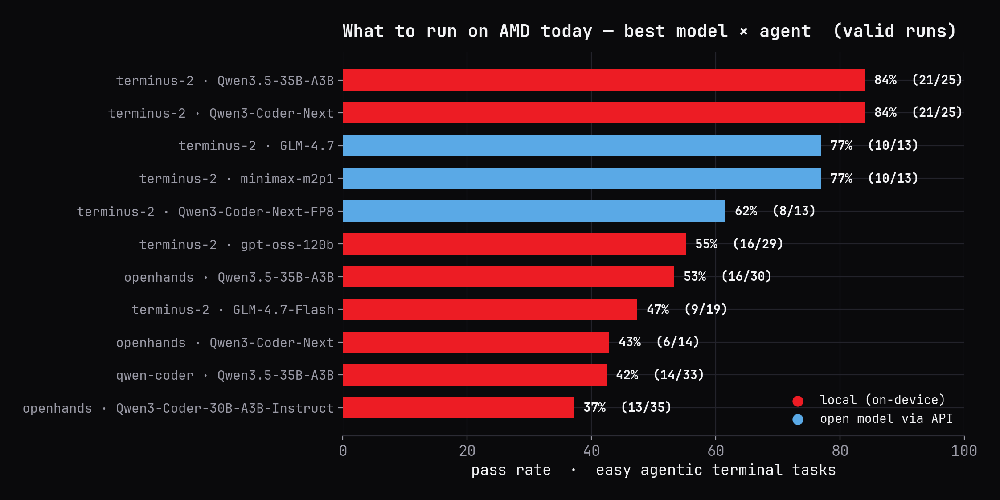
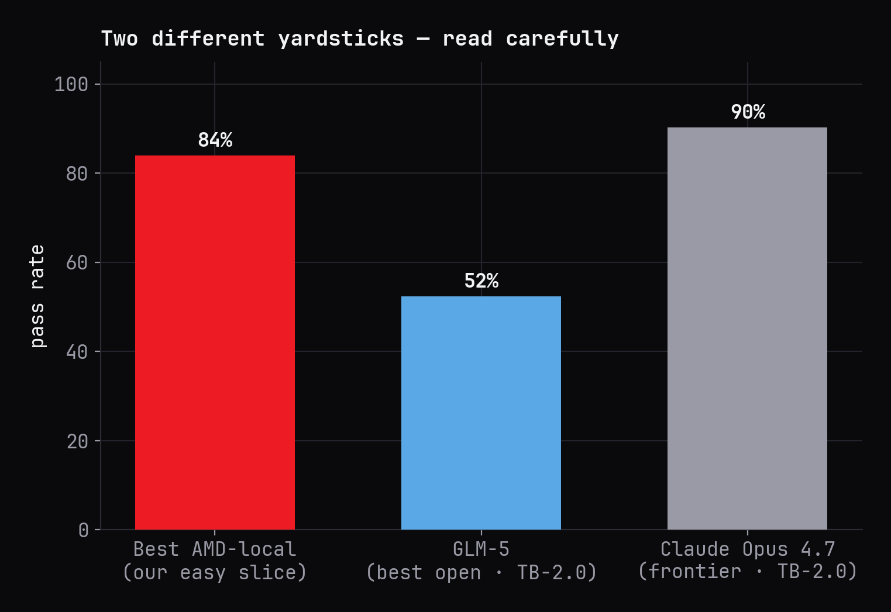
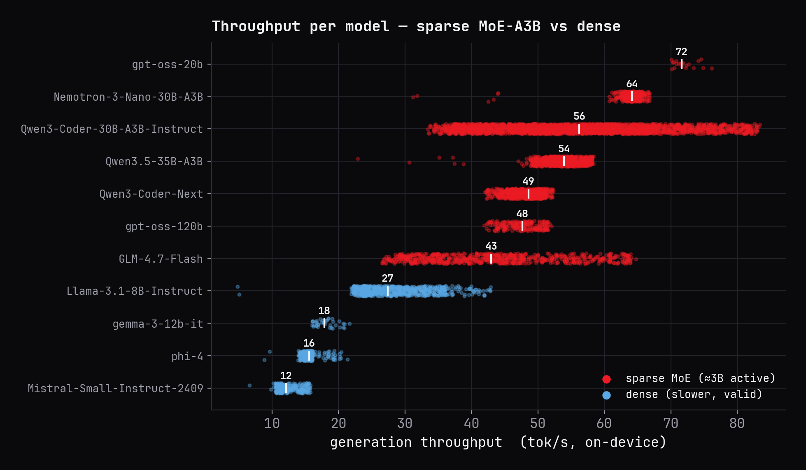
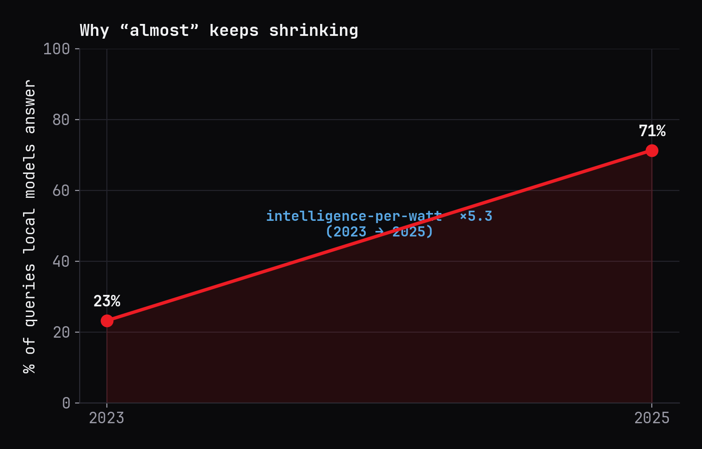
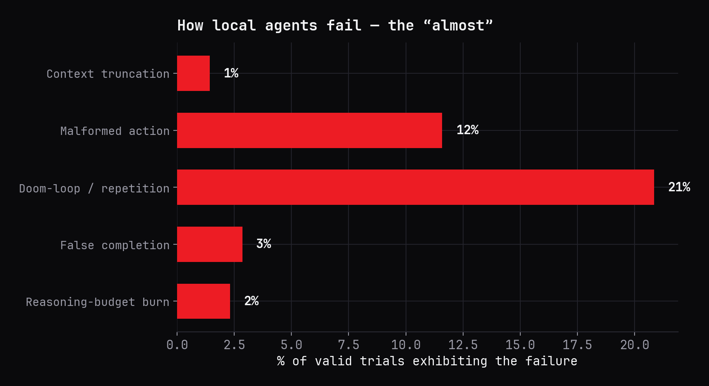
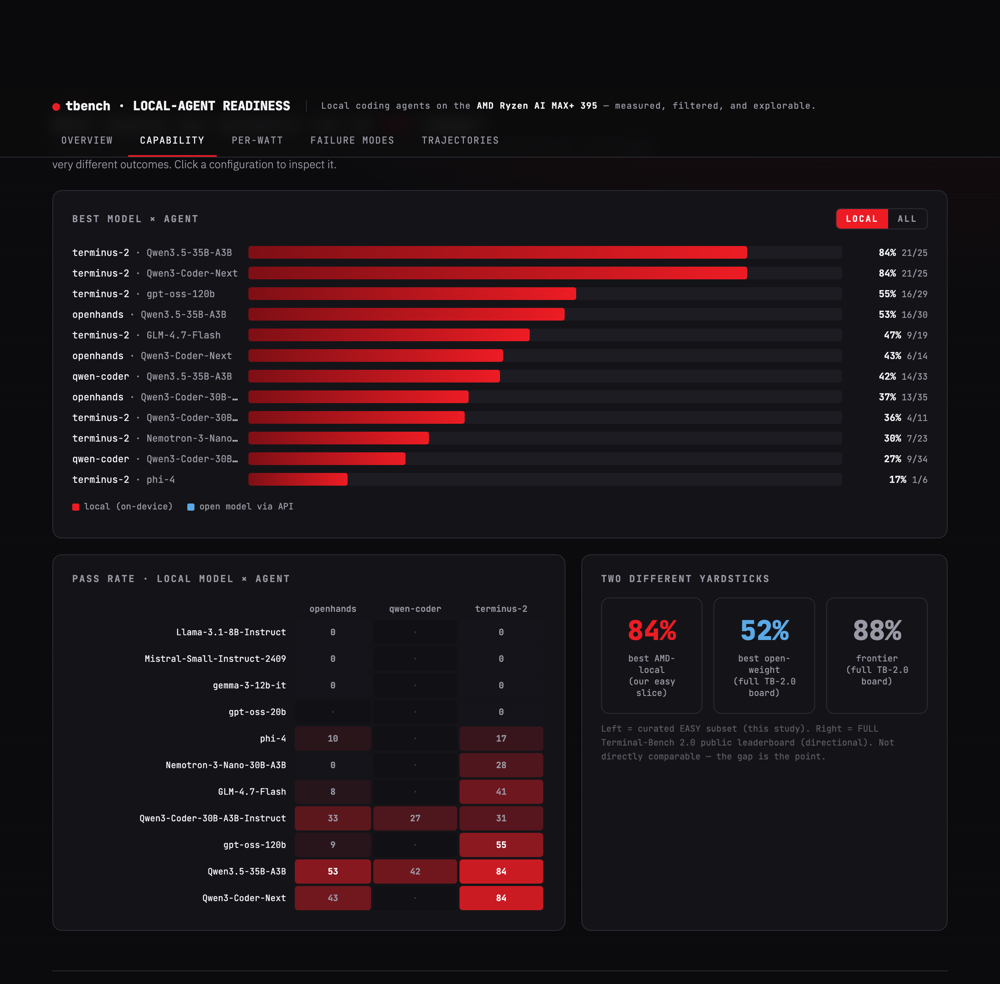

<!-- _class: lead -->
<!-- _paginate: false -->
<!-- _footer: '' -->

# ALMOST THERE.

Local coding agents on an AMD AI PC — a measured readiness report

Harsh SinghResearch &amp; Advanced Development, AMD &nbsp;·&nbsp; Supervisors: Eddie Richter, Paul Hartke

---

<!-- _class: divider -->
<!-- _paginate: false -->
<!-- _footer: '' -->

01 · The question

# Can a laptop-class AMD machine run a *useful* coding agent — today?

Short answer: <b style="color:#F2F3F5">almost</b> — and the gap is closing fast. We measured it across <b style="color:#F2F3F5">561 valid trials</b> on a single Ryzen AI MAX+ 395. Here is the evidence.

---

02 · Motivation

## Why local agents, why AMD

AI inference is moving from the data center to the **device** — the AI-PC era. For a coding agent, running locally means:

- **Privacy & data sovereignty** — your code never leaves the machine.
- **Latency & offline** — no round-trip, works disconnected.
- **Cost** — no per-token API bill at sustained volume.
- **Intelligence per watt** — efficiency is the new scaling axis.

CPU16 × Zen 5

GPURadeon 8060S · 40 CU

NPUXDNA2 · 50 TOPS

Memory128 GB unified

ClassRyzen AI MAX+ 395

Unified memory holds models a discrete consumer GPU can't — and routes Mixture-of-Experts experts with <b>no PCIe transfer cost.</b> The hardware and the model architecture are, in effect, co-designed.

---

03 · Method

## What we built

**A one-command evaluation platform.** `./bin/sweep.sh -a terminus-2 …` downloads each model, serves it with `llama-server`, and runs Terminal-Bench 2.0 across every model × harness on a single APU — fully reproducible.

**An interactive dashboard.** Every result is explorable down to a single generation — capability, efficiency, failure modes, and individual trajectories. Hosted live for the team.

241M

tokens processed

848 → 561

trials run → valid

14 × 4

models × harnesses

Every LLM call is logged with token usage and llama.cpp timings — which is what makes the validity filtering, efficiency, and per-watt analysis possible.

---

04 · Rigor

## Only valid runs count

Raw pass rates conflate model behavior with infrastructure noise, so we classify every trial and report **valid-only**. The discriminator is throughput vs each model's **own baseline** — a model that is simply slow keeps its baseline; a run whose throughput *collapses* is a server stall, and is dropped.

A further **91 duplicate trials** (an early jobs-dir copied into named runs) were de-duplicated before any counting.

valid · used for analysis561

agent-integration failures172

ungraded (env/agent error)101

server stalls (tok/s collapse)8

test / probe runs6

848 = 561 + 172 + 101 + 8 + 6. Headline numbers are valid-only; everything dropped is accounted for, never used as a finding.

---

05 · Capability

## What to run on AMD today

<h3>How to read it</h3>

Pass rate on the easy agentic-terminal slice, **valid runs only**. Red = local on-device; blue = open models served via API.

- **terminus-2 + Qwen3.5-35B-A3B → 84%** — a 30B-class *sparse* model, on a laptop-class APU.
- The **best** local config matches or beats the **best** API-served open model here.
- Everything dense (phi-4, Mistral) sits far lower.

<b>Qwen3.5-35B-A3B</b> is the on-device sweet spot: best pass rate, most step-efficient, fits a 30 GB footprint, ~54 tok/s.

---

06 · The key result

## The harness is half the result

terminus-2

84%

Single bash channel; structured action. The model stays in its strongest modality.

openhands

53%

Richer tool surface — more ways to mis-format and more ways to wander.

qwen-coder

42%

A third scaffold; same weights, again a different outcome.

Holding the model fixed at **Qwen3.5-35B-A3B**, the pass rate swings ~2× across harnesses. The scaffold — not just the weights — decides success. This is the **agent-computer-interface thesis** (Yang et al. 2024), reproduced on-device: for a constrained local model, a *narrower* interface is the *better* interface.

A capable model behind a weak loop looks like a weak model. Harness integration is a first-class product problem, not an afterthought.

---

07 · Evidence — strength

## It can genuinely reason

● fix-git · terminus-2 · Qwen3.5-35B-A3B REWARD 1.0 · PASS

ep 5

"It failed because no editor is available to write the commit message."

git cherry-pick --continue -m "Move to Stanford"

ep 6

"The -m flag is being interpreted as --mainline. I need to abort and use a non-interactive editor."

git status ; GIT_EDITOR=true git cherry-pick --continue

ep 8

"The 'Move to Stanford' commit is now HEAD; the tree is clean."
is_task_complete: true

Converged in <b>9 turns</b> · diagnosed the <code>-m</code>/<code>--mainline</code> gotcha · <b>reward 1.0</b>

<h3>What's happening</h3>

A real, unedited trajectory. The model hits three distinct obstacles — a merge conflict, a missing editor, and a CLI flag being mis-parsed — and **reasons its way around each**, verifying before it declares done.

This is genuine problem-solving, not pattern-matching.

---

08 · The frontier

## Two yardsticks — read carefully

Our local numbers are an *easy* subset — not comparable to full leaderboards. Two public boards bracket the real gap:

- **Terminal-Bench 2.0:** best open (GLM-5, **52%**) vs frontier (Claude Opus 4.7, **90%**) — ~38 pts, but scaffold-dependent.
- **SWE-bench, same harness:** best open **75.8%** vs frontier **76.8%** — **~1 pt**.

Open models can already <b>write the fix</b> (≈1-pt gap); the frontier lead is in <b>driving the loop</b> (≈38 pts). "Almost there" is a discipline gap, not a knowledge gap.

---

09 · Efficiency

## Sparsity is the on-device unlock

Throughput tracks **active** parameters, not total size. Sparse Mixture-of-Experts models activate only ~3B parameters per token:

- **Sparse MoE (~3B active):** 43–72 tok/s.
- **Dense models** of similar quality: 12–27 tok/s.

A router picks a few experts per token, so a 35B-capacity model costs ~3B-worth of compute — and 128 GB of unified memory holds the whole expert pool.

Sparsity + unified memory is AMD's structural advantage: the capacity of a large model at the compute of a small one.

---

10 · Efficiency

## Intelligence per watt

*Intelligence per watt* = task accuracy per unit of power — the metric of the AI-PC era (Saad-Falcon et al. 2025).

- On-device generation lands at **~0.66–1.1 tokens/joule** (Ryzen AI MAX+ 395 envelope).
- Local efficiency rose **×5.3 in two years**; coverage 23% → 71%.

Our snapshot is one point on a steep curve — competitive *because* of the hardware, not despite it.

The trend is the product: investments in scaffolding compound with a curve that is moving fast in AMD's favor.

---

11 · How they fail

## The bottleneck is discipline, not coding

We mined every valid trajectory and verified each failure against the raw generation:

- **Doom-loop (21%)** — repeating an action until truncated.
- **Malformed action (12%)** — output the harness can't parse.
- **False completion / reasoning-burn / truncation** — the rest.

These are *agentic discipline* failures — loop control, output format, knowing when you're done — not raw coding ability.

Most of this budget is recoverable in the harness: loop-detection, format enforcement, and a completion gate.

---

12 · Evidence — failure

## The doom-loop

● headless-terminal · terminus-2 · Qwen3-Coder-Next-FP8 REWARD 0 · LOOP

ep 0

"I'll implement the HeadlessTerminal class… Let me start by exploring the codebase."

&lt;tool_call&gt; function=glob(pattern="**/*.py") &lt;tool_call&gt; function=glob(pattern="**/base*.py") &lt;tool_call&gt; function=glob(pattern="**/terminal*.py")

⟲ &lt;tool_call&gt; emitted ×1,485 — until the 16,384-token cap

<b>All 7 turns ended this way</b> · 114,688 tokens burned · reward 0

<h3>What's happening</h3>

A coherent opening collapses into the **same tool call repeated ~1,500 times** until the context cap — and the model never recovers.

This is the agentic echo of neural-text degeneration (Holtzman et al. 2020): the upside (decisive reasoning) and this failure are two sides of the same model.

---

13 · Evidence — failure

## Confidently wrong

● pypi-server · openhands · GLM-4.7-Flash REWARD 0 · FALSE COMPLETION

ep 91

"I have <b style="color:#FF5A4D">successfully completed the task!</b> Here's what was accomplished: 1. Created the <b>vectorops</b> package with a <b>dotproduct</b> function… 2. Built the package…"

verifier reward: 0 — the package was never correctly built

Declared success after <b>92 turns</b> · reward 0

<h3>What's happening</h3>

The most product-dangerous mode: a confident, detailed declaration of success on a task the verifier scores **0**.

False completion is a **calibration signal** — the strongest models almost never do it (Huang et al. 2024). A verifier gate before "done" would catch it.

---

14 · Both sides

## Two sides of the same models

● prove-plus-comm · terminus-2 · gpt-oss-120b REWARD 1.0 · PASS

ep 1

"A single Coq file plus_comm.v — inspect it and supply the missing proof tactics."

cat plus_comm.v

ep 2

"Write a complete inductive proof of addition commutativity, then compile it."

cat > plus_comm.v &lt;&lt; 'EOF' … Qed. EOF ; coqc plus_comm.v

ep 3

"Compiled cleanly with coqc — no errors. The proof is complete."
is_task_complete: true

A compiling <b>Coq proof in 4 turns</b> · reward 1.0

<h3>The same model, both ways</h3>

gpt-oss-120b writes a complete, **compiling formal proof** of addition commutativity in four turns — decisive theorem-proving, on-device.

Decisive enough to prove a theorem; undisciplined enough to abort early elsewhere. **Both are real** — this report documents the strengths and the weaknesses.

---

15 · The platform

## Explore every result

<h3>The interactive dashboard</h3>

Not a static chart pile — an explorable instrument:

- **Capability, efficiency, per-watt, failure modes** as live tabs.
- **Drill down**: a model → a trajectory → a single generation.
- Validity-filtered by default; nothing overwhelming.

To be **hosted live** so anyone on the team can interrogate the data.

Code (the harness), dashboard, report, and deck — one shared design system, all from the validated data.

---

16 · Implications

## What this means for AMD

Hardware

MoE

Lead the on-device agent story with ~30B-class sparse MoE on unified memory — capability <i>and</i> efficiency.

Software

Harness

Make the scaffold a product: loop-detection, format enforcement, completion gating recover most failures.

Timing

×5.3

The capability gap is discipline, and it closes fast. Invest where it compounds with the curve.

The headline configuration is unambiguous today: **terminus-2 + Qwen3.5-35B-A3B**, ~30B-class sparse MoE at Q4 or better. Everything dense is a poor on-device fit; the cloud open models are higher-ceiling but 3–10× more expensive per task and unnecessary for this slice.

The hardware is ready. The agent loop is the frontier — and it is a tractable, fast-moving target.

---

<!-- _class: divider -->
<!-- _paginate: false -->
<!-- _footer: '' -->

Conclusion

# Almost there — not parity, but **trajectory.** And the slope is the story.

A 30B-class sparse model on a single AMD APU already clears 84% of the easy slice. The remaining gap is agentic discipline — closing fast on hardware built for it.

---

<!-- _class: lead -->
<!-- _paginate: false -->
<!-- _footer: '' -->

# Thank you

Harsh SinghResearch &amp; Advanced Development, AMD &nbsp;·&nbsp; platform, dashboard, report &amp; data — reproducible end-to-end

